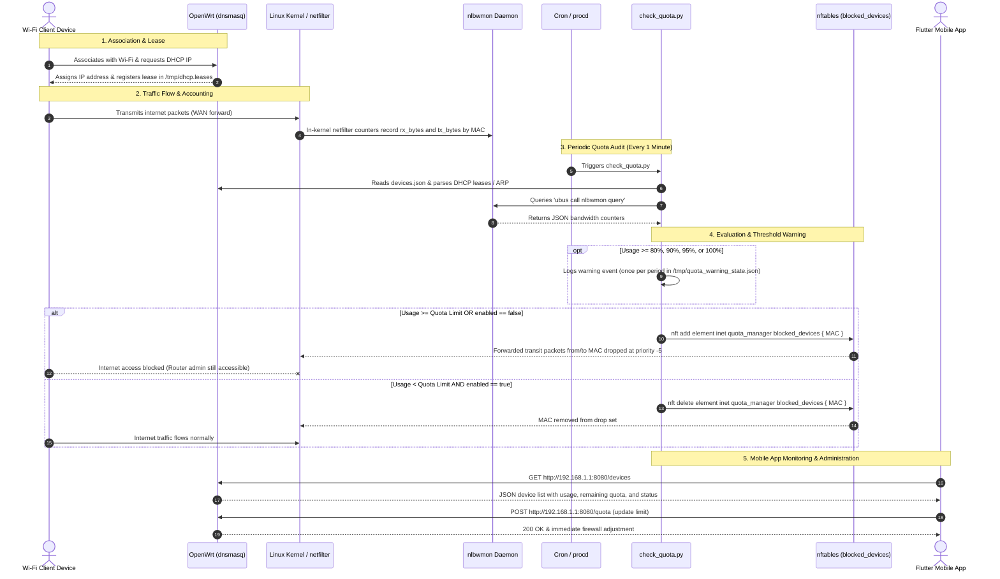

# Operational Workflow (`openwrt/docs/workflow.md`)

This document details the step-by-step lifecycle of a client device connecting to the Wi-Fi network, tracking bandwidth, receiving quota warnings, triggering firewall blocks, and unblocking upon cycle reset.

---

## 🔄 End-to-End Sequence Diagram



---

## 📝 Lifecycle Phases

### Phase 1: Device Connection & Discovery
1. The client device connects to the OpenWrt access point.
2. `dnsmasq` allocates an IP address and records the lease in `/tmp/dhcp.leases` with:
   - Expiry timestamp
   - Client MAC address
   - Assigned IP address
   - Client hostname (e.g. `Ahmed-Phone`)
3. `device_manager.py` discovers this device and cross-references its MAC against `devices.json`.

### Phase 2: Bandwidth Accounting (`nlbwmon`)
1. Traffic flowing between the local network (`br-lan`) and the WAN gateway is tracked passively by `nlbwmon`.
2. Statistics are stored in RAM (`/tmp/nlbwmon.db`) and refreshed continuously.

### Phase 3: Quota Inspection Loop & Warning Thresholds
1. Every minute, the OpenWrt cron scheduler triggers `check_quota.py`.
2. **Usage Calculation**: `usage_manager.py` extracts byte counters from `ubus call nlbwmon query`.
3. **Threshold Check**: If usage reaches 80%, 90%, 95%, or 100%, a warning is logged. Duplicate warnings in the same billing period are prevented by `/tmp/quota_warning_state.json`.

### Phase 4: Access Enforcement (`nftables`)
1. If **EXCEEDED**:
   - `check_quota.py` executes:
     ```bash
     nft add element inet quota_manager blocked_devices { AA:BB:CC:DD:EE:FF }
     ```
   - Packets from this MAC traversing the forward chain to the internet are dropped immediately.
   - Management connections to the router (`http://192.168.1.1`, SSH, DNS, DHCP) remain active.
2. If **ALLOWED**:
   - `check_quota.py` executes:
     ```bash
     nft delete element inet quota_manager blocked_devices { AA:BB:CC:DD:EE:FF }
     ```

### Phase 5: Quota Period Reset
1. When the billing cycle ends (or upon administrator reset via `check_quota.py --reset` or `POST /reset`):
   - Warning state file is reset.
   - All enabled devices are removed from the `blocked_devices` set in `nftables`.
   - Normal traffic flow resumes for the new billing period.
