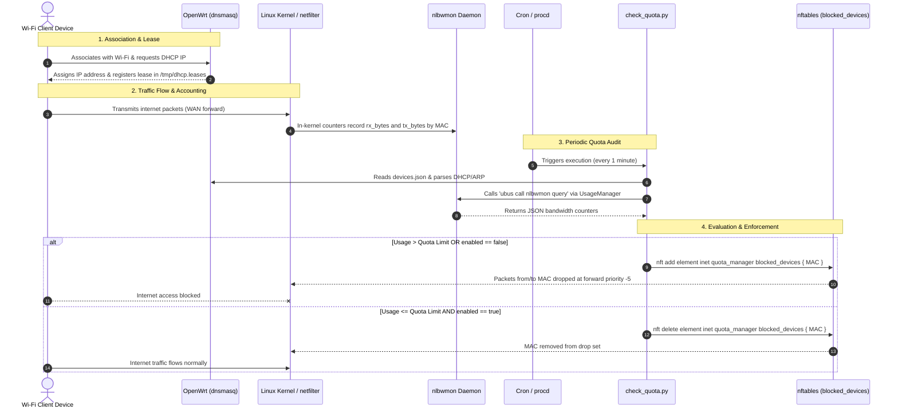

# Operational Workflow (`openwrt/docs/workflow.md`)

This document details the step-by-step lifecycle of a client device connecting to the Wi-Fi network and how bandwidth consumption is monitored and enforced.

---

## 🔄 End-to-End Sequence Diagram



---

## 📝 Lifecycle Phases

### Phase 1: Device Connection & Discovery
1. The client device connects to the OpenWrt access point (SSID).
2. OpenWrt's `dnsmasq` server allocates an IP address and records the lease in `/tmp/dhcp.leases` with:
   - Expiry timestamp
   - Client MAC address
   - Assigned IP address
   - Client hostname (e.g. `Ahmed-Phone`)
3. `device_manager.py` can immediately discover this device and cross-reference its MAC against `openwrt/config/devices.json`.

### Phase 2: Traffic Monitoring (`nlbwmon`)
1. Traffic flowing between the local network (`br-lan`) and the WAN gateway is tracked passively by `nlbwmon`.
2. `nlbwmon` associates all incoming and outgoing bytes with the specific hardware MAC address of the source/destination device.
3. Statistics are stored in RAM (`/tmp/nlbwmon.db`) and refreshed continuously.

### Phase 3: Quota Inspection Loop
1. Every minute, the OpenWrt cron scheduler triggers `check_quota.py`.
2. **Device List Retrieval**: `device_manager.py` parses `devices.json` and normalizes all MAC addresses.
3. **Usage Query**: `usage_manager.py` queries `ubus call nlbwmon query` and converts byte totals to Gigabytes.
4. **Policy Comparison**:
   $$\text{Decision} = \begin{cases} \text{BLOCK} & \text{if } \text{enabled} = \text{false} \lor \text{usage\_gb} > \text{quota\_gb} \\ \text{ALLOW} & \text{if } \text{enabled} = \text{true} \land \text{usage\_gb} \le \text{quota\_gb} \end{cases}$$

### Phase 4: Access Enforcement (`nftables`)
1. If **BLOCK**:
   - `check_quota.py` executes:
     ```bash
     nft add element inet quota_manager blocked_devices { AA:BB:CC:DD:EE:FF }
     ```
   - Future forwarded packets matching this MAC are dropped immediately at the raw forward chain hook before NAT or routing.
2. If **ALLOW**:
   - `check_quota.py` executes:
     ```bash
     nft delete element inet quota_manager blocked_devices { AA:BB:CC:DD:EE:FF }
     ```
   - Device resumes unrestricted access.
